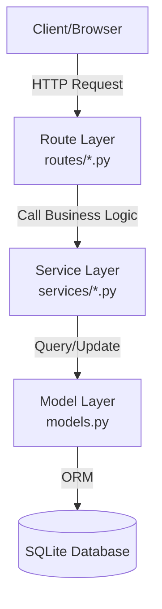

# Architecture: BookClub

## Layered Architecture
The application follows a strict three-layer architecture to ensure separation of concerns and maintainability.

### 1. Route Layer
Responsible for receiving HTTP requests, extracting parameters (like `tz`), calling service functions, and formatting JSON responses.
- `routes/books.py`: Book management.
- `routes/reading.py`: Reading progress tracking.
- `routes/stats.py`: Statistics and streaks (handles `tz` param).

### 2. Service Layer
Contains all business logic and calculations. Services are independent of the transport layer (HTTP) but accept parameters like `tz_name`.
- `services/reading_service.py`: CRUD for reading events.
- `services/stats_service.py`: Logic for streaks, page counts, and monthly summaries.

### 3. Model Layer
Defines the data structure and relationships using SQLAlchemy.
- `User`: Member profiles and persistent stats.
- `Book`: Shared library of titles.
- `ReadingEvent`: Join table recording when a user starts and finishes a book.

## API Interface: Statistics

### GET `/stats/<user_id>?tz=<timezone>`
- **reading_streak**: Days with at least one finish.
- **books_this_month**: Finished in current local month.
- **total_pages_read**: Sum of pages of all finished books.

### GET `/stats/<user_id>/genre-streak/<genre>?tz=<timezone>`
- **streak**: Genre-specific reading streak.

## Flow Example: Streak Calculation
1. **Client** requests `GET /stats/alex_id?tz=America/New_York`.
2. **`routes/stats.py:get_stats()`** extracts `tz` and calls `stats_service.calculate_streak(user_id, tz_name)`.
3. **`services/stats_service.py:calculate_streak()`** calls `reading_service.get_reading_history(user_id)`.
4. **`services/reading_service.py:get_reading_history()`** queries `ReadingEvent` models filtered by `user_id` and `finished_at is not None`.
5. **`stats_service`** converts UTC `finished_at` to the requested timezone and performs the consecutive day logic.
