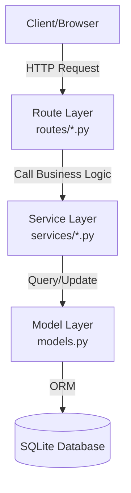

# Architecture: BookClub

## Layered Architecture
The application follows a strict three-layer architecture to ensure separation of concerns and maintainability.



### 1. Route Layer
Responsible for receiving HTTP requests, extracting parameters, calling service functions, and formatting JSON responses.
- `routes/books.py`: Book management.
- `routes/reading.py`: Reading progress tracking.
- `routes/stats.py`: Statistics and streaks.

### 2. Service Layer
Contains all business logic and calculations. Services are independent of the transport layer (HTTP).
- `services/reading_service.py`: CRUD for reading events.
- `services/stats_service.py`: Logic for streaks, page counts, and monthly summaries.

### 3. Model Layer
Defines the data structure and relationships using SQLAlchemy.
- `User`: Member profiles and persistent stats.
- `Book`: Shared library of titles.
- `ReadingEvent`: Join table recording when a user starts and finishes a book.

## New API Interface: Genre Streak

### GET `/stats/<user_id>/genre-streak/<genre>?tz=<timezone>`

- **Description**: Returns the current reading streak for a specific genre.
- **Parameters**:
  - `user_id` (path): The ID of the user.
  - `genre` (path): The genre to calculate the streak for (e.g., `sci-fi`).
  - `tz` (query, optional): The user's local timezone (e.g., `America/New_York`). Defaults to `UTC`.
- **Response JSON**:
  ```json
  {
    "user_id": "uuid",
    "genre": "sci-fi",
    "streak": 3
  }
  ```

## Flow Example: Streak Calculation
1. **Client** requests `GET /stats/alex_id`.
2. **`routes/stats.py:get_stats()`** receives the request and calls `stats_service.calculate_streak(user_id)`.
3. **`services/stats_service.py:calculate_streak()`** calls `reading_service.get_reading_history(user_id)`.
4. **`services/reading_service.py:get_reading_history()`** queries `ReadingEvent` models filtered by `user_id` and `finished_at is not None`.
5. **SQLAlchemy** retrieves data from the DB.
6. The result flows back up the stack, with `calculate_streak` performing the date-diff logic.
